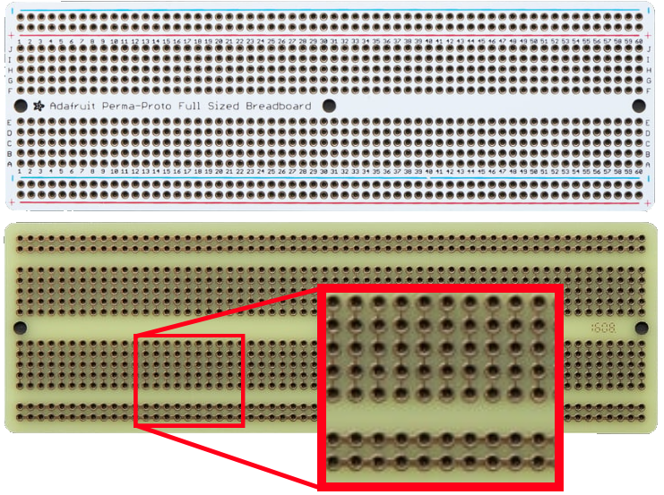
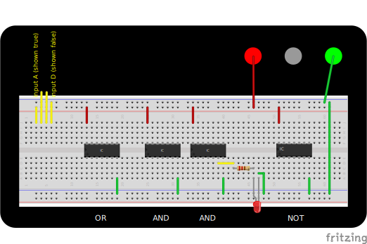

# Familiarization Lab: Digital Logic and Breadboarding

In this familiarization lab you will create the digital logic circuit you developed during class. 

## Objective

Illuminate an indicator light if:

- one (and only one) spacecraft from plane 1 is in view

  AND

- one (and only one) spacecraft from plane 2 is in view

## Hardware

- solderless breadboard
- LED
- resistor
- integrated circuit chips
  - OR
  - (2x) AND
  - NOT (i.e. inverter)
- jumper wires
- power supply

## Documentation

Refer the the three datasheets—one for each IC type. 

## Connections

A solderless breadboard enables rapid prototyping and provides the ability to instantly connect electronic components by inserting them. They can also be removed easily. 

Components are connected by wires, but the breadboard itself also provides some connections. This image of a solderable breadboard shows how the points are connected. Each set of five points in the middle of the board is connected (for example, A1-B1-C1-D1-E1). In addition, the four long strips along the side of the board are connected. These strips are usually used for power and ground. 

The breadboard for this lab already has four IC chips installed. You will connect them to complete the logic circuit. 

### LEDs

LEDs (light emitting diodes) are directional—the longer leg (or bent leg) must be connected to power, and the shorter leg to ground. In addition, an LED must be connected in series with a resistor or it will burn out. 

## Procedures

Install the ground and power wires as shown in red and green. 

- Short wires are better—they will stay out of the way when you add more wires later. 

- To avoid confusing yourself later, it is often helpful to use green wires for ground and pick a color for 5V power.  

 Connect the LED and resistor—this is your circuit output. 

Connect jumper wires to form your logic circuit. 

Connect input wires as shown in yellow. You can use this area to send inputs to multiple places. 

- As shown, all of F3–J3 are connected to input A.
- Connecting an input to 5V represents TRUE
- Connecting an input to ground represents FALSE

When you have completed wiring your logic, connect the breadboard to a 5V power supply. Move the wires to provide different input combinations and verify your output matches your predictions. 