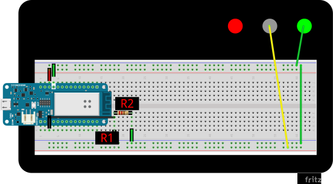
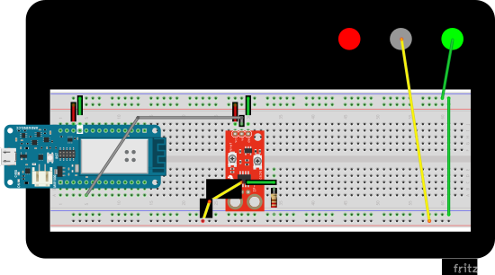
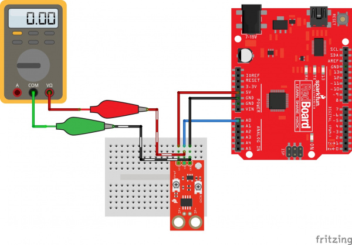
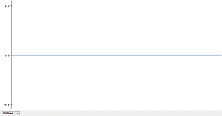
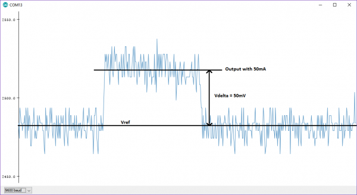
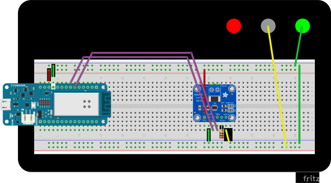

# Lab 0: metrology

> metrology: the science of  measurement, embracing both experimental and theoretical determinations  at any level of uncertainty in any field of science and technology
> -International Bureau of Weights and Measures (BIPM) 

In this introductory lab you will gain familiarity with lab equipment and with taking measurements. 


Previously, you determined the current and voltage limits of a 4-cell solar array. In a future lab you will measure the array's current and voltage output and create an I-V curve to characterize the solar array. In this lab you will begin learning how to measure analog signals with FlatSAT—the bridge between an analog world and digital engineering. 

To measure FlatSAT's current and voltage, you must pick appropriate sensors. 


## Overview

- voltage measurement

  - voltage divider
  - analog-to-digital converter (ADC)

- current measurement

  - hall effect sensor
  - shunt resistor

- Arduino basics

  

## Hardware 

- Arduino MKR 
- multimeter
- benchtop power supply
- resistors
- 
- current sensing ICs


## Software 

- Arduino IDE
- `lab 00 metrology.ino`


## Documentation

- Arduino MKR datasheet
- Sparkfun Hall sensor datasheet


## Preliminary

- git sync -> pull
- tortoisegit -> switch/checkout -> main
- inspect and run `lab 00 metrology/install_libraries.bat`


## Solar arrays limits

For this lab, use these values as your solar array's max current and voltage. 

|              | series | parallel |
| ------------ | ------ | -------- |
| current (mA) | 40     | 160      |
| voltage (V)  | 30     | 7.5      |


## Voltage

To accurately measure FlatSAT's solar array performance, your sensor must be able to measure DC voltage from 0–30 V. 

Investigate this requirement. 

### Multimeter

- Turn on your benchtop power supply and set it to 5 V/0.5 A. 
- Turn your multimeter to the 600 V range
- Connect wires with banana plugs between the power supply and the multimeter
- Adjust the power supply up and down in 0.1 V increments (use the dial)
- What happens? Record observations in your lab notebook. 

These multimeters are *2000 count* multimeters—a common resolution for digital multimeters. They have 4-digit precision from -1999 counts to 1999 counts. A count is the smallest discrete measurement the multimeter can make. A 2000 count multimeter is also known as a 3-1/2 digit multimeter. They have 4 digits until 1.999, and then 3 digits from 2.00 to 9.99. 

Ranges on a multimeter can provide precision proportional to the range. 

- 0–1.999 V
- 0–19.99 V
- 0–199.9 V
- 0–600. V

Internally, a 2000 count multimeter uses a 12-bit analog-to-digital converter (ADC). 2^12^ = 4096 bits, a close match for -1999 to 1999 counts.  

What multimeter range should you use to measure your 0–30 V array output? What is the best resolution you can achieve? 

### Arduino limits

Now you will prepare to measure voltage with an Arduino MKR. 

First, review the Arduino MKR datasheet. 

- Allowable input voltage: 
  - see the warning at the bottom of page 2
- Max ADC resolution: 

Record these values in your lab notebook. 

Using these values, how many digits do you expect to be able to report for the voltage of FlatSAT's 30 V solar array?


Every sensor is resolution-limited and provides maximum resolution when the range of the measured signal is matched to the sensor's detection range. 

To achieve the best available voltage resolution you will need to map the 0–30 V panel voltage to the 0–3.3 V input range of the Arduino MKR. Note: 3.3 V is sometimes referred to as 3V3. 

If you connect anything higher than 3.3 V directly to an input pin on your Arduino, the best possible outcome is that the measured input will remain pegged at "1" or "3.3V." More likely is that you will permanently damage your Arduino. 

To map a 30 V signal to a 3.3 V sensor, you will use a voltage divider. 

### Voltage Divider

>A **voltage divider** is a passive linear circuit that produces an output voltage V~out~ that is a fraction of its input voltage V~in~.**Voltage division** is the result of distributing the input voltage among the components of the divider. A simple example of a voltage divider is two resistors connected in series, with the input voltage applied across the resistor pair and the output voltage emerging from the connection between them.
>-Wikipedia


$V_{out} = \frac{R_2}{R_1+R_2}V_{in}$

Approximately how much do you need to reduce your input voltage? What relative values of $R_1$ and $R_2$ will give you that ratio? Work this out in your lab notebook. 

Now you have to pick actual resistors and make a voltage divider. 

Keep in mind: 

- $V = IR$
- $P=IV$
- your resistors are 1/4 W resistors
- an ideal voltmeter has infinite resistance

Select resistors for R1 and R2. Ensure your resistors won't smoke or catch fire. Record these values in your lab notebook. 

**At this time, explain your choice to your instructor.** 




**Note:** Do not connect your Arduino to power or to a computer at this time. 

Place R1 and R2 on the breadboard as shown. R1 is the larger resistor. 

Connect and energize a 30 V power supply to the bottom rail of the breadboard. 

With your multimeter, measure voltages. 

- ground–middle
- ground–top (30 V) 

Ground–middle should be less than 3.3 V. 

​		**Stop. Do not proceed until Ground–middle is ≤ 3.3 V**

Record these measurements in your lab notebook. 


### Arduino measurement

Now you will measure voltage with Arduino. Open `lab 00 metrology.ino`.

#### Arduino program flow

Review `lab 00 metrology.ino`. Every Arduino program look like this:

- // comments begin with `//`
- /* comment blocks (multiline comments) are surrounded by `/* … */` */

- Commands in global namespace 
  - For example, defining global constants
  - You cannot call functions here–that's why `analogReadResolution(XX)` is not included here
- void setup() {…}
  - The `setup` function takes no arguments (the empty parentheses) and returns no outputs (`void`)
  - This function runs once
- (Optional) Additional commands and variable definitions in global namespace.
- void loop(){…}
  - The `loop` function runs as long as the Arduino has power
  - It can include calls to functions defined elsewhere, usually after the final `}` of loop() 
- (Optional) Function definitions can appear after loop()


Look at the penultimate line of `lab 00 metrology.ino`.

```c++
  delay(100);
```

This line inserts a delay of 100 milliseconds between every run of loop(). This prevents the serial monitor from scrolling uselessly fast. However, it's a terrible way to run a program. Since Arduino is a single-processor microcontroller, *nothing* else can happen during the delay. 

This is acceptable for a simple program like this one, used to calibrate a sensor. However, FlatSAT constantly needs to accomplish and monitor multiple tasks, so it won't be acceptable in the future. 

#### Verify electrical connections

Energize the power supply. **With a voltmeter, ensure that Arduino pin A1 only sees 3.3 V from ground even when the power supply provides 30 V.** 

#### Measure!

- Connect Arduino to your computer. 

- Select the correct board (tools -> board -> SAMD -> Arduino MKR 1000)

- Select the correct port (COMXX—try one until it works). 

- Click *upload* (right arrow near the top of the window). 

Open the Arduino IDE's serial plotter (tools -> serial plotter). Select "value 1" and unselect "value 2." 

The serial plotter will show a moving graph. Adjust the power supply **downward only** and watch the plotted line move. As the power supply moves from 30 V–0 V, Arduino sees from 3.3 V–0V. What range of values does the serial plotter display? 

This is because of the 12-bit ADC resolution. You must add a scale factor to output the correct voltage. 

Arduino's default ADC resolution is 10-bit. `lab 00 metrology.ino` uses the command `analogReadResolution(12);` to instead select a higher 12-bit resolution. 

With an input range of 0–3.3 V and 12-bit/4096 count, Arduino's sensitivity is 0.8 mV/count (3.3V/4096 count). 

To properly display Arduino's **measured voltage in mV**, you must **multiply the ADC reading `volt_counts` by 0.8.** 

However, you instead want to display the voltage of your solar array/solar array simulator. You must **multiply the measured voltage** by the ratio of your voltage divider. 

$voltage = volt\_ counts * \left(\frac{XX\ mV}{count} * \frac{R_1}{R_1+R_2}\right)$ 

Calculate this factor and change the following code line to include the proper scale factor (instead of `sensitivity`, which was set to 1 earlier in the code). 

```c++
 float voltage = volt_counts * sensitivity;
```

Upload this modified code and ensure that the serial plotter matches the output of your power supply. If not, adjust as necessary. 


Congratulations! You can measure voltage! 


### Intermediate cleanup

- turn off the benchtop power supply (on/off button not illuminated)
- disconnect Arduino
- remove the ACS723 current sensor and associated wires


## Current—Hall effect sensor

There are two general ways to measure current. 

- measuring the induced magnetic field around a current-carrying conductor
- measuring a voltage drop across a known resistance

You will attempt to use the first method with a Hall effect sensor. 

The solar array current you are trying to measure is very small (as low as 40 mA in parallel), so you will need a very sensitive current sensor. You will use the low current version of Sparkfun's ACS723 breakout board. Read the highlighted datasheet now. Is this a suitable sensor?

**Note: You will use Vcc = 3.3 V to avoid damaging the Arduino MKR board.**


### Connect Hall effect current sensor

Install and connect the current sensor. Since the sensor is so long, you will have to install the wires underneath the sensor, before you place the sensor on the breadboard. 

Connect Vcc and ground to Arduino's Vcc and ground, using the breadboard's power rails. 

Connect Vout to Arduino's pin A3. 

Set your benchtop power supply's limits to 3.3 V and 150 mA. 

Connect IP+ and IP- to your benchtop power supply.



### Calibration and Example Code

The following instructions are modified from the example provided at https://learn.sparkfun.com/tutorials/current-sensor-breakout-acs723-hookup-guide. 

#### Setting Vref 

Connect Arduino to the computer. 

`lab 00 metrology.ino` reads a voltage from pin A3 and prints it to the serial terminal (as the 2nd value). 

To set up Vref, the sensor should have no current flowing through it. Leave the benchtop power supply off.  You can also (optionally) read the output voltage using a [multimeter](https://www.sparkfun.com/products/12966). See the Fritzing diagram below for more information:



In the serial plotter unselect "value 1" and select "value 2."  Value 2 shows the voltage reading from the Arduino in real time. The units are in millivolts.

With a #1 Phillips screwdriver, turn the Vref potentiometer clockwise to increase Vref and counter-clockwise to decrease. Make small adjustments, as the adjustment is very sensitive!

**Note:** Using metal/magnetized screwdrivers may cause the sensor to give false readings. This is because the Hall effect sensor inside is picking up the magnetic fields from the screwdriver. If you experience this, simply make a small adjustment and then move the screwdriver away to see the result. 

In the Serial Plotter, you should see something like this:



Since you are measuring a positive DC current, Vref should (ideally) be zero. However, the Vref potentiometer can go past zero, and when it does the sensor produces no output. To avoid that, adjust Vref to a small value, approximately 10 mV. 

#### Setting Gain/Sensitivity

To set the gain, you need to pass a known current through the sensor and tune the gain pot to achieve the sensitivity your application needs. Since you are measuring a small current, you will first try with gain/sensitivity set to maximum. 

The risks of maximum gain are noise (spiky data) and clipping. Clipping occurs when the measured current exceeds the limits of your system. For example, in this circuit, if 100 mA registers as 3.3 V, the current sensor will be unable to distinguish between 100 mA and 150 mA. 

Turn on your benchtop power supply (3.3 V, 150 mA). The serial plotter should show a new output voltage. 

With a known constant current flowing through the sensor, the gain can be adjusted. Adjust the gain to its maximum. The serial plotter should show a higher output voltage. 

If you have problems, you may have to reverse current flow (swap the leads at the power supply) and/or adjust Vref to its maximum. 

Disconnect and reconnect the IP+ wire to find output voltage at (near) the expected limits of your solar array's power input. Can you usefully detect this current? 

Using Vdelta, calculate sensitivity (mA/mV) and adjust the following line of code. 

```c++
float current = (curr_counts*0.8 - Vref) * sensitivity;
```




Attempt to measure 40 mA and 10 mA. Record your observations. Is this a suitable sensor? 


### Intermediate cleanup

- turn off the benchtop power supply (on/off button not illuminated)
- disconnect Arduino
- remove the ACS723 current sensor and associated wires


## Current—Ohm's Law

Now try measuring current with a different sensor: INA219 (on an Adafruit breakout board). This sensor uses Ohm's law to calculate current from the voltage drop across a known precision resistor. 

Review the INA219 datasheet. Record the Voltage and Current range in your lab notebook. Is this a suitable current sensor? 

INA219 measures both current and voltage—there is no need for a separate voltage divider circuit. 

### git

Switch to a new branch that has different code for `lab 00 metrology.ino`. 

- tortoisegit -> switch/checkout -> `current sensor 2` 
- **Note: this will fail**

Your attempt to switch branches failed because you changed `lab 00 metrology.ino` The current saved version differs from the committed version. 


You must do one of three things before you can checkout the `current sensor 2` branch. 

- *commit* your changes **(Do not do this! It will interfere with lesson content for future sections.)**
  - (Here's how you would commit your changes)
    - git commit -> "main"
    - A tortoisegit commit window opens
    - select the updated files to commit
    - "commit"
  - You would then *push* your changes to the remote repository (github)
- *revert* your changes
  - You can do this
  - tortoisegit -> revert
  - This will permanently discard the changes you made and revert `lab 00 metrology.ino` to the version of record, the *committed* version
- *stash* your changes
  - You can do this
  - tortoisegit -> stash -> give descriptive name -> OK
  - This will:
    -  save your changes to a temporary parallel location
    - revert `lab 00 metrology.ino` to the version of record, the *committed* version


Now that your code contains no uncommitted changes, git will allow you to switch branches. Do it. 

- tortoisegit -> switch/checkout -> `current sensor 2`


### Connect Ohm's law current sensor

The INA 219 current sensor communicates with Arduino using I2C. This is handled with the Adafruit_INA219 library. 

Connect power

- VCC (3.3 V)
- ground 

Connect I2C comm lines between Arduino and the current sensor

- SDA
- SCL

Connect sensing lines

- power supply + -> Vin+ 
- Vin-  -> 330 Ω resistor -> ground



#### Arduino program flow

Open `lab 00 metrology.ino`. (Line 2 should read "lab 00 metrology (B).")

Scan through the file and look at these lines

```c++
long present_time = 0
long write_due = 0;
long write_interval = 100;

void loop() {
...
present_time = millis(); 
    
    if(write_due < present_time){ 
    ...
        
    write_due += write_interval; 

    } // end if write_due
    
} // end function loop()
```

Instead of using delay, this sketch constantly runs as fast as it can. If it's time to write data (every 100 milliseconds), it will write data to the serial port. This method is better than `delay()` because it allows Arduino to continue running and performing other functions. 

In the Arduino ecosystem, this method of program control is often called BWD (blink without delay). However, this example is better than the default BWD example because of how it measures the time delay. 

#### Measure! 

Connect Arduino to your computer and upload code. 

Turn on your benchtop power supply (3.3 V, 150 mA).

Open the serial plotter. 


Now you can see voltage and current displayed on the serial plotter. Adjust the power supply's output current and watch the values change. 

How much noise do you see? Try at 160 mA, 40 mA, and 10 mA. 

Is this sensor suitable for monitoring FlatSAT's solar array?

Record observations in your lab notebook. 


## Think about calibration

Are the values reported by these sensors accurate? If you needed a more accurate measurement, how would you accomplish it? 

How does SSRC accomplish accurate measurements when working on FalconSAT? 

- We send our measurement equipment to the local AF PMEL (precision measurement equipment laboratory) for calibration.

How does PMEL ensure the accuracy of their calibration standards? 

Watch the following video. 

https://www.youtube.com/watch?v=_k9egfWvb7Y


## Cleanup

Switch back to the main repository branch. 

- tortoisegit -> switch/checkout -> `main`


Return lab station to pre-lab condition

- disconnect Arduino
- turn off power supply
- remove all wires and sensors from breadboard (leave Arduino on the breadboard)
