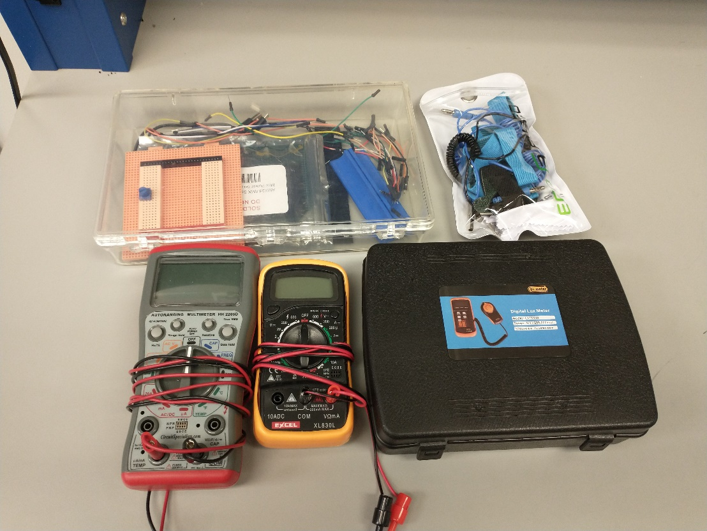
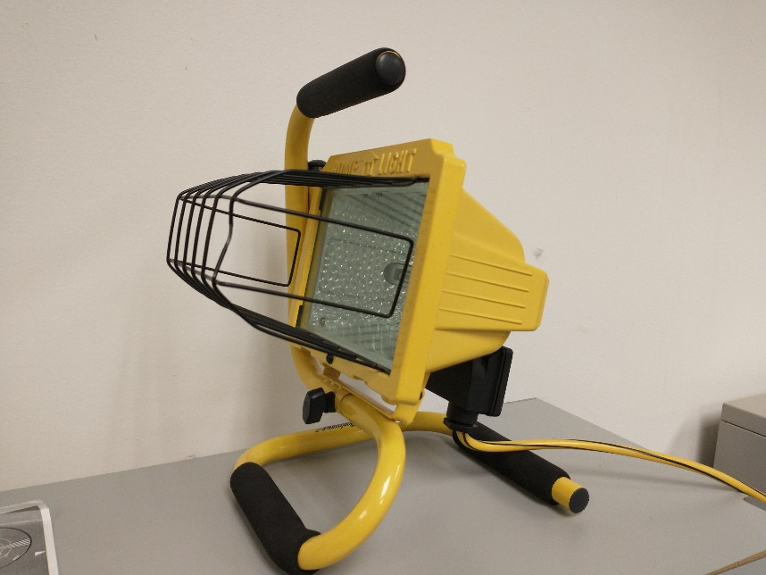

# Lab 1: electrical power

In this lab you will test FlatSAT's solar panel to determine if it will generate enough power to satisfy mission requirements. You will measure the voltage and current generated by the solar array at various voltages to generate an I-V plot. You will take collect two sets of I-V measurements, one for a series-connected array and one for a parallel-connected array. 

You will also record the incident luminosity with a luxmeter. 

In your final lab report, you will compare your prelab performance predictions to the results you record in this lab. You will present your I-V plot and use it to identify your array's peak power. You will calculate array efficiency using the incident luminosity and the peak power generated. Finally, you will recommend any design changes necessary to ensure the solar array can meet mission requirements.

## documentation

- 16 x 2 character LCD pinout
- Arduino MKR Zero pinout
- INA 219 datasheet
- `lab 01 electrical power.ino`

## software

- Arduino IDE
- Arduino libraries (install by running `install_libraries.bat`)
  - LiquidCrystal
  - Adafruit INA219

## hardware

* ESD-safe grounding straps

* Black case with a luxmeter inside

* On top of your lab station, a yellow halogen lamp

* Case containing:

  * breadboard with Arduino MKR ZERO
  * LCD display
  * resistor
  * INA219 current sensor breakout board
  * potentiometer
  * solar panel
  * battery holder
  * 3x charged 18650 Lithium Ion cells
  * 5 V BEC/UBEC (universal battery eliminator circuit) switching regulator
  * wires
  * microSD card 
  * USB microSD card reader
  
  
  
  

## setup

Whenever you handle the Arduino or any microcontroller electronics, be sure that you have a grounding strap on, to prevent unintentional electro-static discharge (ESD). The strap should have contact with your skin and the banana plug end should plug into one of the grounding holes (indicated in red) on the front of your lab bench. There are two grounding plugs at each lab station.

- connect power and ground lines

  **Note**: Arduino MKR ZERO uses 3.3 V logic and may be damaged if it sees input greater than 3.3 V on any pin (except the 5V in on "5V"). However, the LCD display requires 5 V power. Take care to keep the 3.3 V, 5 V, and 25 V power lines separate (all grounds should be connected, including Arduino's ground pin). 

    - Top rail: 3.3 V (diagram: orange wires)
    
      - 3.3 V supply comes from VCC pin of Arduino

    - Bottom rail: 25 V (solar array---yellow wires)

    - 5V is supplied directly to the LCD from Arduino's 5V output pin (red wires)

- **Have your instructor check your connections** 

- prepare microSD card
- Install current sensing and readout components on FlatSAT. 
- INA 219 current sensor

  - LCD display (this is test equipment and will not be used in space)

### prepare microSD card

The Arduino MKR Zero has a microSD card slot. You will use this card to store data in various labs. If this is your first lab with an SD card, prepare the card. 

- write your group name on a microSD card
- insert the card in the USB reader and connect to your computer
- Format the card
  - Window Explorer -> Right click -> format -> Fat 32 -> Ok
- Insert the card into your Arduino MKR Zero

### INA 219 current sensor

The INA 219 current sensor communicates with Arduino using I2C. This is handled with the Adafruit_INA219 library. 

Connect power

- VCC (3.3 V)
- ground (any ground is fine)

Connect I2C comm lines (blue and grey in the diagram)--ordinarily you would connect them directly to Arduino, but please follow the diagram to make room for future FlatSAT components

- SDA
- SCL

Connect sensing lines

- solar+ -> Vin+ 
- Vin-  -> potentiometer -> solar ground

### 16x2 LCD

Commodity LCDs such as this one have a 16 pin header. The LiquidCrystal Library controls communication using a standard LCD protocol. 

Connect LCD power

- pin 1: ground
- pin 2: 5 V

Connect backlight power

- pin 16: ground
- pin 15: 5 V

Connect contrast circuit

- pin 3: ground

Connect communication lines

- RW: ground
- RS, EN, D4, D5, D6, D7
  - connect to Arduino according to the coded values in `lab 01 electrical power.ino` 
  - (see LiquidCrystal initialization section)

### solar array

Record which solar panel you are using. 

Connect the four cells of the array in series. You will complete the data collection steps, and then repeat them with the cells connected in parallel. 

Connect the solar array's output to the breadboard's bottom power rail. 

## upload FlatSAT code and test setup

Open `lab 01 electrical power.ino` in the Arduino IDE. 

Connect Arduino to computer via USB. 

Select the correct board (Arduino MKRZERO) and port. 

Expose the solar panel to the halogen light. 

Upload your code. 

Open serial monitor (tools -> serial monitor).

Slowly turn the potentiometer and watch the current and voltage change on the LCD. 

Disconnect the Arduino and turn off the halogen light. 

### prepare for outdoor testing

For outdoor testing, FlatSAT will be powered by a 3-cell 18650 Lithium ion battery with the cells connected in series, providing a nominal 11.1 V. The input pin of an Arduino MKR Zero (or MKR 1000) can tolerate 5-5.5 V. You will use a switching regulator called a BEC to step the supply voltage down from 12 V to 5 V. 

Arduino will further step the 5 V down to 3.3 V for its internal logic. 3.3 V out is also available on the Vcc pin to power peripherals. 

Arduino pins: 

- Vin: 5 V power input
- 5V: 5 V power output (for some peripherals)
- Vcc: 3.3 V power output
- Gnd

**Note**: applying 12 V directly to Vin will break your Arduino. 

- Velcro the battery holder to back of breadboard. 
- Connect 3-cell 18650 Li-ion holder to posts on breadboard holder. 

- Using banana plugs, connect the battery holder wires to the posts on your breadboard
  - Red: positive
  - Black: negative
- Connect the BEC 
  - 12 V side connects to breadboard posts
  - 5 V side connects to FlatSAT
    - Red: Vin
    - Black: ground rail
- **Have your instructor check your connections**
- Insert Li-ion cells and verify that FlatSAT works
- remove cells

## data collection scheme

FlatSAT saves current and voltage to `datalog.txt` every 1 second. On each powerup it writes "start of data" and then begins logging data. Subsequent powerups will again write "start of data" and add more data to the file. The powerup and "start of data" message can be used to separate test runs. It will be obvious which run is series vs parallel. 

## collect solar array performance data outside

Disconnect power so you're not saving excess data. 

Take FlatSAT and the luxmeter outside and find a test site in direct sunlight. 

Point the luxmeter toward the sun and record the sun's power in lux. You will have to adjust the range to its maximum setting. The measured value may jump around, try to take an average value. Record the average for later use calculating efficiency. 

Point FlatSAT at the sun and power it on. *Very* slowly turn the potentiometer from one end to another. FlatSAT will record current and voltage at 1-second intervals. You will record periodic current and voltage measurements from the LCD display as a backup in case the stored data gets corrupted or lost. 

Disconnect power, rewire the solar array in parallel, and repeat these steps to collect the parallel I-V data. 

## data reduction (after the lab)

- transfer `datalog.txt` to your own computer for later analysis
- create a plot showing both panel I-V curves: series and parallel 

  - remember to include your earlier measurements of open-circuit voltage and short-circuit current
- Compare your experimental results to the predicted I-V curve in your prelab. Discuss and explain any differences. Discuss how the serial and parallel I-V plots differ and whether those results match your expectations. 
- Determine the peak power point for each I-V curve. Label it on your plot and include the results in a table in your final lab report. 

**Peak power point in sunlight for each I-V curve**

|          | voltage | current | power |
| -------- | ------- | ------- | ----- |
| series   |         |         |       |
| parallel |         |         |       |

- calculate efficiency for each connection scheme (series and parallel). 

  - Convert the recorded illuminance (lumen) from the luxmeter to irradiance. This conversion depends on the spectral distribution of your light source (sunlight or halogen).

  $$
  1\  \mathrm{lux} = \frac{1\ \mathrm{lumen}_{\mathrm{sunlight}}}    {\mathrm{m^2}} 0.0082\ \mathrm{W m^{-1}}
  $$

  $$
  1\  \mathrm{lux} = \frac{1\ \mathrm{lumen}_{\mathrm{halogen}}}{\mathrm{m^2}} 0.05\ \mathrm{W m^{-1}}
  $$

  - Calculate efficiency using the irradiance from your light source (sunlight) and the peak power produced by your solar panel (do this twice--series and parallel)

  $$
  P_{\mathrm{panel}} = \frac{P_{\mathrm{peak}}}{A_{\mathrm{panel}}}
  $$

  $$
  \eta = \frac{P_{\mathrm{panel}} }{\mathrm{irradiance}}
  $$

  - Compare measured efficiency to the efficiency you calculated in your prelab. Comment on your results. 