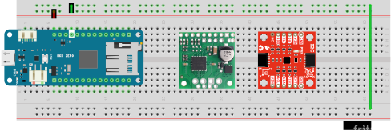
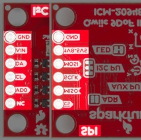
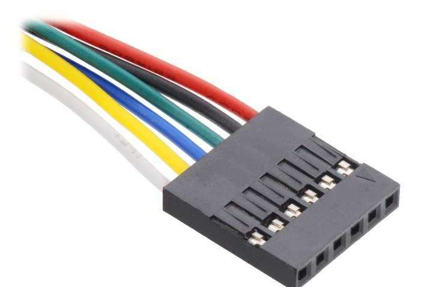

# Lab 4: attitude

In this lab you will build and test part of FlatSAT's attitude system including an attitude sensor and reaction wheel. (FlatSAT's design calls for 3 reaction wheels but you will only test 1.) You will measure system performance to ensure that FlatSAT can meet it's orbital torque and momentum requirements. 

In your final lab report, you will compare prelab predictions to experimental results. 

Prelab report instructions: https://www.overleaf.com/read/prdzpknpdtgf

## documentation

- Arduino MKR Zero pinout
- motor datasheet (Pololu 37D metal gearmotor)
- motor driver datasheet (Pololu TB905FTG motor driver carrier)
- IMU datasheet (SparkFun 9DoF IMU)

## equipment

- tachometer
- benchtop power supply
- string

## software

- Arduino IDE
  
  - `lab_04_attitude.ino`

- Arduino libraries (install by running `install_libraries.bat`)
  
  - SparkFun 9DoF IMU…
  - TB9051FTGMotorCarrier
  - QuadratureEncoder
  - EnableInterrupt
  

## hardware

* ESD-safe grounding straps

* FlatSAT

  * TB9051FTG motor driver carrier
  * SparkFun 9DoF IMU Breakout

* LEDs 
* resistors
* reaction wheel
* 3 cell Li-ion battery
* BEC

## setup

Whenever you handle the Arduino or any microcontroller electronics, be sure that you have a grounding strap on, to prevent unintentional electro-static discharge (ESD). The strap should have contact with your skin and the banana plug end should plug into one of the grounding holes (indicated in red) on the front of your lab bench. There are two grounding plugs at each lab station.

- connect power and ground lines

  - Top rail: 5 V (diagram: red wires)
    - Note: this is different than previous labs!
    - 5 V supply comes from 5 V pin of Arduino
- place IMU and motor driver on FlatSAT

### IMU

The inertial measurement unit (IMU) communicates with Arduino via SPI. However, the SPI labels are printed on the bottom of the board and won't be visible after the IMU is placed on the breadboard. Use the datasheet and this diagram to get the wires correct. 

- (wrong IMU pin) right IMU pin–Arduino pin
- (GND) GND to ground
- (Vin) Vin to 5V
- (DA) MOSI to MOSI (may be labelled COPI)
- (CL) SCLK to SCK
- (AD0) MISO to MISO (may be labelled CIPO)
- (NC) CS to D6

### motor driver

FlatSAT controls a brushed DC motor via a Toshiba TB9051FTG brushed motor driver. FlatSAT sends a low-volt/low-current pulse-width modulated (PWM) signal to the motor driver board. The driver board provides line voltage to the motor at the same duty cycle. A high signal is full voltage and a low signal is zero voltage, and we use the duty cycle to essentially act as a fraction between those two. So, a 50% duty cycle corresponds to applying 50% of the total voltage that would correspond to the motor’s top speed. Thus, the higher the PWM command, the faster the motor will spin.

- (driver pin–Arduino pin)

- GND to ground

- ENB to ground

- VCC to 5V

- EN to 5V

- PWM2–D3 (~3)

- PWM1–D2 (~2)

- OCM–A1

  

- leave 2 wires sticking out of Vin and GND (the motor side)

  - These will later connect to a 12V supply for motor power

### motor

FlatSAT's reaction wheel motor is a metal gearmotor (Pololu item 4758). 

- gear ratio: 10:1
- voltage: 12 V

The motor has a 6-wire connector with 2 wires each for motor power, speed encoder power, and encoder output. Connect it to FlatSAT. 

| FlatSAT pin       | motor harness color | function         |
| ----------------- | ------------------- | ---------------- |
| motor driver OUT1 | red                 | motor power      |
| motor driver OUT2 | black               | motor power      |
| ground            | green               | encoder ground   |
| 5V                | blue                | encoder power    |
| Arduino D0 (0)    | yellow              | encoder output A |
| Arduino D1 (1)    | white               | encoder output B |

## rotor mass properties

Measure the diameter and mass of the reaction wheel. There is a spare rotor and a scale on the filing cabinets near the door. Use these values in your final lab report to calculate momentum storage and compare your predictions to measurements. 

## motor performance

Measure motor speed and torque. 

The reaction wheel motor specs are provided for 12 V, but FlatSAT will operate at a nominal 11.1 V. Measure the motor's torque and maximum speed. 

Set the power supply to 11.1 V. (Be careful not to apply this to any Arduino pins or connected rails.) Connect the motor driver's input wires (the ones you left disconnected) to the power supply and turn it on. 

Open `max_speed\max_speed.ino`. This Arduino sketch will command the motor at its maximum speed for approximately 10 seconds. Upload the sketch to run it. You may have to open the serial monitor to start the test. 

Use the tachometer to measure the speed. Record this value in your lab notebook and use it to calculate momentum storage in your final report. 

This sketch will also send time, speed, and current data to the serial port. You can use these to calculate motor torque. 

$$ T = I \alpha$$

$$ \alpha = \frac{d \omega}{dt} $$

Unfortunately, Arduino IDE's serial monitor window is broken. You can't copy data out of it, and using another serial monitor is too complicated for one lab. As a result, your instructor will provide this data after the lab. 

Use the provided data to determine wheel torque and compare the result to your prelab predictions. 

Turn off the power supply. 

## attitude determination

Now you will test FlatSAT's attitude sensor as the reaction wheel changes spacecraft attitude.   

Install an SD card into FlatSAT. Open and upload `lab_04_attitude.ino`. Open the serial plotter and place FlatSAT in different orientations. Wave a magnet around the sensor. Disconnect FlatSAT. 

`lab_04_attitude.ino` will command the wheel to different speeds and record magnetometer and gyroscope data. 

Connect the battery to FlatSAT. 

- motor input wires and the BEC should connect directly to the battery. 
- the GND output (black) should connect to Arduino's GND pin
  - don't connect the BEC +5 V output until you are ready to test the reaction wheel

Tape FlatSAT to one end of the reaction wheel assembly. Using string, hang the assembly from the hook at your workstation. Make it level. 

When you are ready, connect the BEC's 5 V output to Arduino's Vin. This is what will happen. 

- The rotor will spin up and maintain a steady-state speed of approximately 500 RPM for approximately 10 seconds. Hold FlatSAT steady during this time. 
- The LED will illuminate when FlatSAT is holding still. If it’s drifting you can help it gently. 
- The LED will deluminate when FlatSAT is accelerating. Don’t touch it. 
- FlatSAT's wheel speed will ramp up and back down over the course of 5 seconds, ending up at 500 RPM. FlatSAT should hold steady at this orientation for 5 seconds. 
- FlatSAT's wheel speed will ramp down and back up over the course of 5 seconds, again ending up at 500 RPM. FlatSAT should hold steady at this orientation for 5 seconds. 
- FlatSAT will command the wheel to zero speed. FlatSAT will begin spinning quickly. 
- After 5 seconds of spinning, stop FlatSAT and remove power. 

FlatSAT will record information from its rate gyros and magnetometer to `attitude.csv` on the SD card. Remove the SD card and save the data for your team's later use. 

## Lab station cleanup

- Transfer saved data to your group's storage location
- Disconnect devices from FlatSAT and all computers
- Remove the ESD wrist straps and replace them in the bag at your lab station.
- Replace all items at your lab station the way you found them. 
- Close Arduino IDE, and log out of the laptop.
- Have your instructor check off your lab station before you depart.

## Post-lab data analysis

Use your measured mass properties and the provided max speed/acceleration data to determine reaction wheel torque. 

Use your recorded attitude data to determine the MOI of the entire FlatSAT assembly. Do this with the wheel speed data and IMU data immediately before and after the wheel turned off. 

Include graphs of IMU data (magnetometer AND rate gyro) in your final report. 

