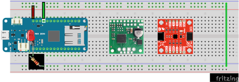

# Lab 4: attitude

In this lab you will build and test part of FlatSAT's attitude system including an attitude sensor and reaction wheel. (FlatSAT's design calls for 3 reaction wheels but you will only test 1.) You will measure system performance to ensure that FlatSAT can meet it's orbital torque and momentum requirements. 

In your final lab report, you will compare prelab predictions to experimental results. 

Prelab report instructions: https://www.overleaf.com/read/prdzpknpdtgf

## documentation

- Arduino MKR Zero pinout
- motor datasheet (Pololu 37D metal gearmotor)
- motor driver datasheet (Pololu TB905FTG motor driver carrier)
- IMU datasheet (SparkFun 9DoF IMU)

## equipment

- tachometer
- benchtop power supply

## software

- Arduino IDE
  
  - `lab_04_attitude.ino`

- Arduino libraries (install by running `install_libraries.bat`)
  
  - SparkFun 9DoF IMU…
  - TB9051FTGMotorCarrier
  - QuadratureEncoder
  - EnableInterrupt
  

## hardware

* ESD-safe grounding straps

* FlatSAT

  * TB9051FTG motor driver carrier
  * SparkFun 9DoF IMU Breakout

* LEDs 
* resistors
* reaction wheel
* 3 cell Li-ion battery
* BEC

## setup

Whenever you handle the Arduino or any microcontroller electronics, be sure that you have a grounding strap on, to prevent unintentional electro-static discharge (ESD). The strap should have contact with your skin and the banana plug end should plug into one of the grounding holes (indicated in red) on the front of your lab bench. There are two grounding plugs at each lab station.

- connect power and ground lines

  - Top rail: 5 V (diagram: red wires)
    - Note: this is different than previous labs!
    - 5 V supply comes from 5 V pin of Arduino
- place IMU and motor driver on FlatSAT

### IMU

The inertial measurement unit (IMU) communicates with Arduino via SPI. However, the SPI labels are printed on the bottom of the board and won't be visible after the IMU is placed on the breadboard. Use the datasheet and this diagram to get the wires correct. 

- (IMU pin–Arduino pin)
- GND to ground
- Vin to 5V
- MOSI to MOSI (may be labelled COPI)
- SCLK to SCK
- MISO to MISO (may be labelled CIPO)
- CS to D6

### motor driver

The motor driver uses pulse width modulated (PWM) digital signals from Arduino to control the speed of a brushed motor. 

- Connect GND and ENB to ground
- Connect VCC and EN to 5V
- Connect the PWM lines
  - PWM2–Arduino D3 (~3)
  - PWM1–Arduino D2 (~2)
- leave 2 wires sticking out of Vin and GND (the motor side)
  - These will later connect to a 12V supply for motor power

### motor

FlatSAT's reaction wheel motor is a metal gearmotor (Pololu item 4758). 

- gear ratio: 10:1
- voltage: 12 V

The motor has a 6-wire connector with 2 wires each for motor power, speed encoder power, and encoder output. Connect it to FlatSAT. 

| FlatSAT pin       | motor harness color | function         |
| ----------------- | ------------------- | ---------------- |
| motor driver OUT1 | red                 | motor power      |
| motor driver OUT2 | black               | motor power      |
| ground            | green               | encoder ground   |
| 5V                | blue                | encoder power    |
| Arduino D0 (0)    | yellow              | encoder output A |
| Arduino D1 (1)    | white               | encoder output B |

### XBee breakout

The XBee radio communicates with Arduino using serial communication. Serial communication uses two wires: transmit and receive. 

Connect serial lines

- XBee 3 (DOUT) -> Arduino D13 (RX)
- XBee 4 (DIN) -> Arduino D14 (TX) 

ArduCAM-M-2MP communicates with Arduino using both I2C and SPI. The Arduino sketch handles these protocols with the `Wire` and `SPI` libraries. I2C: sensor configuration. SPI: camera commands and data stream (images). 

Note the orientation of the connections in the diagram: the camera board should be vertical with the sensor looking over the LCD. 

Connect power

- VCC (5 V)
- ground (any ground is fine)

Connect I2C comm lines--these are already in place from lab 1

- SDA
- SCL

Connect SPI comm lines

- SCK (clock)
- CIPO (controller in/peripheral out)*
- COPI (controller out/peripheral in)*
- CS (chip select)

**\*Note**: some components and documentation use master/slave terminology (MISO/MOSI), and some use controller/peripheral (CIPO/COPI). MISO = CIPO, MOSI = COPI. 

## Program FlatSAT

- Connect the USB Xbee explorer into the lab PC
  - Note the number written it tape on this XBee module---it should be "XXC." This number is the last 2 digits of the channel your radio will use. Each group will use a different channel to avoid interference. Write this number in your lab notebook. 
- Connect FlatSAT to the lab PC
- Open `lab 03 communication.ino`
- From the tools menu, select the correct board (MKR Zero) and port
  - Note the port number (COMXX) of the "Unknown" device and record it in your lab notebook. This is the serial port number of your ground station's XBee device.
- In `lab 03 communication.ino` you will see a line that says “#define PAN_ID “3332”. Ensure that the last two digits in the PAN_ID match the two digits that were on the tape on your XBee. In this screenshot, the matching number on the FlatSat would be “32.” If the PAN_ID does not match the number on your FlatSat module, modify the last two digits to match the number on your FlatSat module. This step syncs your radios so that they won't interfere with the radios of other lab groups.

- Compile (verify) your file. 
- Upload the file to the Arduino. You should see the LED labelled “L” on the Arduino board blink three times in rapid succession when the upload completes. You will also get a message in the black dialog box at the bottom of the IDE window. If you have any errors uploading, double check that you have the correct board and port selected.
- Gently disconnect the USB cable from the Arduino and disconnect the USB end of the cable from the laptop.

## Setup the ground station

- Attach a small antenna to the RP-SMA connector of your ground station radio. 
- If your FlatSat radio has an RP-SMA connector, attach a small antenna to it.

- If you don't already have the serial port number of your ground station antenna (COMXX), find it from device manager
  - Open Device Manager on the lab station PC, and click on “Ports.” Note which port number is assigned to your ground antenna (there should only be one active port, as you should have already disconnected the USB to the Arduino).

- In a text editor, open `.\ground_station\config.json`

- In the “radio_config” section, modify the “port” name to match the serial port ("COMXX") of your ground antenna. 
- Modify the “pan” number to match the two-digit number written on the tape on your ground radio. Save your changes and close the Config file.

## Connect FlatSAT to the second laptop

- Connect FlatSAT to a USB port on a second laptop. You should see a green LED light up on the board, indicating it has power.

- Open Arduino IDE 

- From the tools menu, select the correct board (MKR Zero) and port

- Open the serial monitor (tools menu)

- A dialog box should open with the number of your COM port at the top. This helps with debugging error messages from the Arduino. Ensure that the “Autoscroll” and “Show timestamp” boxes are checked.

- You should start to see messages from Arduino. If they end with “ Received: OK and 0 0” then you are good to go. If the messages continue to autoscroll without stopping, you will need to disconnect your USB cable from your laptop and close the serial monitor. Then you will need to re-connect the USB cable to your laptop and re-open the serial monitor. If you do not get the “OK” message in the serial monitor the second time, double-check that you connected all of the wires correctly.

## Sending and Receiving Data

- We will now be using a simulated ground station software, written in Python, to communicate from the ground station radio (connected to your laptop) to your FlatSat (the breadboard radio). Open Thonny on the lab station PC.

- Open `.\ground_station\main.py`

- Click the Green triangle button just below the “View” tab along the top left. This will run the main Python script that is managing the communication between the ground station radio and the FlatSat radio.

- A pop-up window called “Cube Sat Response” should appear. Click on the teal Arduino icon on the top-left to open communications between the ground radio and the FlatSat radio.

- You should see a message pop up saying “Attempting to connect to OSCAR-12.” Then, a second or so later you should see another message saying “OSCAR-12 Command Port Ready.” Your ground radio and FlatSat radio are now communicating! If you receive an error message, click on the red “X” icon to close the communication attempt. Wait a second or two, then click on the teal Arduino icon again. Sometimes this connection can be finicky, and you’ll need to attempt it more than once.

- Within the “Cube Sat Response” dialog box, click on the “Help” menu item. A dialog box will open showing all of the possible commands you can send. Today, we are interested in determining the received signal strength (RSSI). There are two different ways to measure it: the RSSI of the FlatSat antenna and the RSSI of the ground antenna. For your lab report, you need to determine the RSSI of the ground antenna (that is the received signal strength on the ground from the FlatSat). That command is “get_rssi.”

- Close the “Help” menu. Type `get_rssi` into the command line prompt and click “Transmit.”

- You should get a value back in dBm (decibel-milliWatts). Click on the red “X” icon to disconnect communications. 

- Now, you are ready to set up your FlatSat Module at the pre-determined distances and take measurements of the signal strength. To appropriately space out the two antennas to perform your data collection, you will be moving FlatSat and leaving the ground station antenna connected to your lab station laptop. Using the measuring tape, position the laptop such that the FlatSat antenna is 0.5 meters away from the ground antenna. The antennas should be level and parallel. 

- Click on the teal Arduino icon on the top-left to open communications between the ground radio and the FlatSat radio. As before, you should see a message pop up saying “Attempting to connect to OSCAR-12.” Then, a second or so later you should see another message saying “OSCAR-12 Command Port Ready.”

- Within the “Cube Sat Response” dialog box, type in `get_rssi` and click “Transmit.” Record the RSSI value in your notes for use in your final lab report. Don’t forget that the value you record is in dBm, and you’ll need to convert it to dB to compare with your predictions! Click on the Red “X” icon to disconnect communications after taking each measurement.

- Repeat steps 9-12 above for distances of 1 meter, 2 meters, and 5 meters. Note: If you get the same value for “get_rssi” for any of the distances, ensure that you have closed communications and re-opened them between each data collection. You should have different values of RSSI for each distance.

**Note: If you do not record these RSSI values at each distance, you will have to repeat the lab. Don’t forget to write them down!**

- Try changing out your small antenna on your ground station antenna (the small red USB stick) with the larger antenna – representing that ground stations typically have much higher gain than the spacecraft. Gently disconnect the XBee USB Dongle from the laptop before you unscrew the small antenna and screw in the large antenna. The large antenna has a gain of 5 dB – see if you notice the difference in the RSSI values. Take a measurement at one of the distances you already did (0.5, 1, 2 or 5 m) and compare your results.

## send data

- You may be as far or as close as you would like for these next few steps 

- 

- Click on the teal Arduino icon on the top-left to open communications between the ground radio and the FlatSat radio. As before, you should see a message pop up saying “Attempting to connect to OSCAR-12.” Then, a second or so later you should see another message saying “OSCAR-12 Command Port Ready.”

- Within the “Cube Sat Response” dialog box, type in the command “turn_on_pin_3”. You should see the LED connected to Digital Pin 3 light up. Then type in the command “turn_off_pin_3”. You should see the LED connected to Digital Pin 3 turn off. 

- Repeat Step 15 for Digital Pin 4 and Digital Pin 5. Try this at various distances around the lab to see how far your radio link will allow you to send commands from. Try walking out into the hallway and see how far you can get and still receive commands. (The measuring tape is only 30’, so you’ll have to approximate distances–use the floor tiles as a standardized distance.) You will need to comment on how far you are able to transmit and receive in your final lab report.

- At a short distance, try to take an image with FlatSAT and send it back over the radio link to the ground station (lab station laptop). You can watch the data streaming in Thonny. Using your cell phone or watch, time how long it takes from the time you send the command to take an image until you receive it on the ground station (it should pop open automatically when transfer is complete). The command for that is “get_picture”. Recall from our Payloads lesson that it could take a while if the data rate is not very high. If you are able to receive an image, save the image to include the image in your final lab report. If you don't receive anything after five minutes, you may close communications by click on the red "x" icon. Whether you receive an image or not, comment on how long it took and what that means for the FlatSat communications design.

## Lab station cleanup

- Transfer any captured images to your group's storage location
- Disconnect devices from FlatSAT and all computers
- Remove the ESD wrist straps and replace them in the bag at your lab station.
- Replace all items at your lab station the way you found them. 
- Close the GUI, close the Arduino IDE, and log out of the laptop.
- Have your instructor check off your lab station before you depart.
